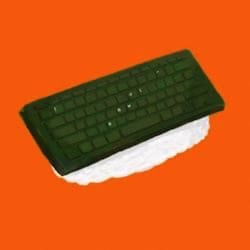

<!-- 

  
  <h1>Ryohei Yamaguchi</h1>
  <li>
ML engineer & Secure computation engineer
</li>
  
Yahoo! Japan, Eaglys Inc.
 -->
<!-- 
 -->
<!-- |  ||
| :-- | :-- |
| <image src="./icon.jpeg" width=50>  | Ryohei Yamaguchi  ML engineer, Secure computation engineer. |
| -->

Ryohei Yamaguchi
 
ML engineer, Secure computation engineer.

# Profile
I'm working as a data scientist at Yahoo! JAPAN and developping systems related to Auto Speech Recognition. In addition, I'm working as a Secure computation engineer at Eaglys and developping libraries and systems of Homomorphic Encryption. 

&ensp;

&ensp;

&ensp;

